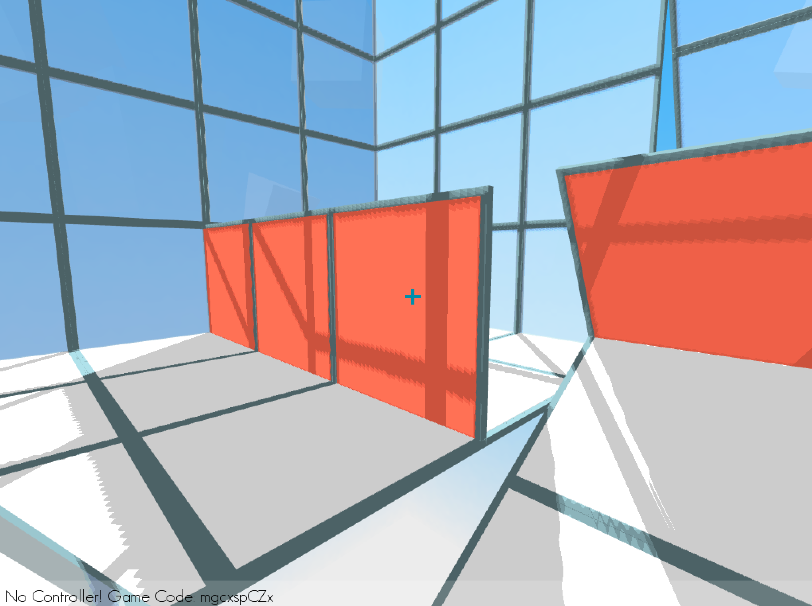
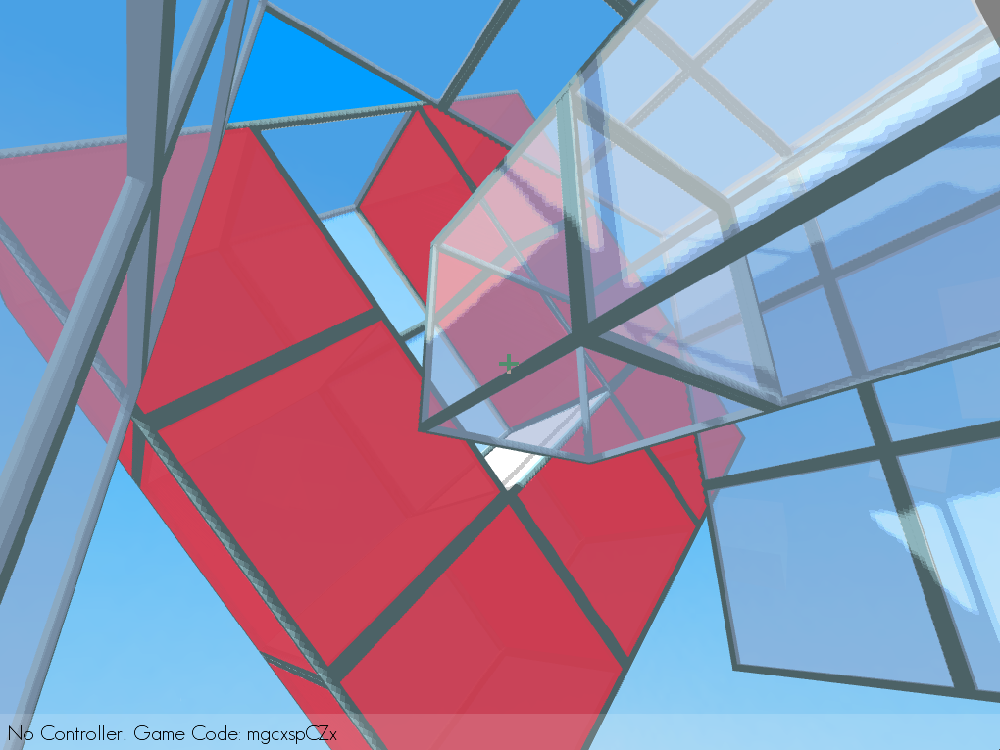
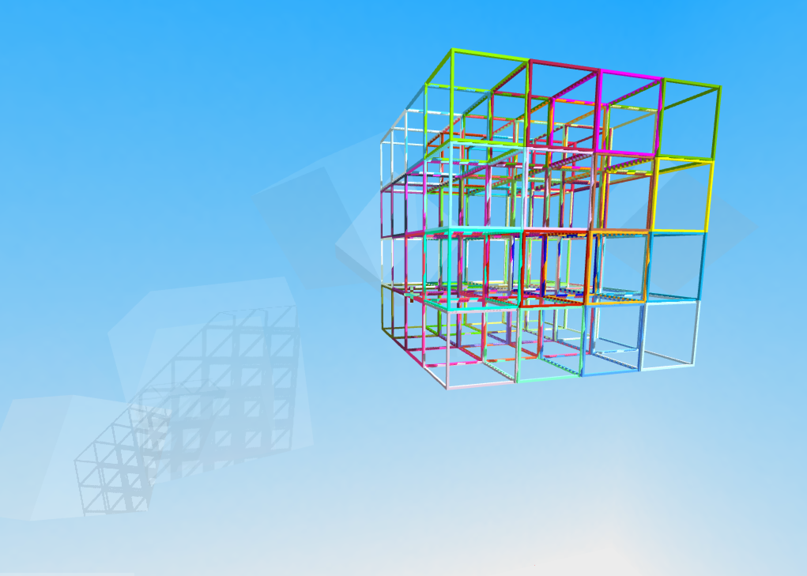

# Rubik Rooms: DandyHacks 2017 Project

Rubik Rooms is an experimental cooperative puzzle game with a novel control scheme. The game features a connection between a mobile game player and a desktop game player through a common world.

The team of Chris Dalke and Nate Conroy built Rubik Rooms as part of the DandyHacks 2017 hackathon, the fourth annual computer science hackathon held at the University of Rochester. Our team won 1st place overall at the hackathon out of over 79 teams.

Nate: "Worked on the backend logic to model the rotational behavior of the cube's planes along the axes, developed game levels."

Chris: "Developed Java 3d engine code, graphics programming, and worked on networking interface between the iOS player and the PC player."

## Video

## Screenshots

## Summary
_from the original Hackathon submission:_

Rubik Rooms is an experimental cooperative puzzle game with a novel control scheme. The game features a connection between a mobile game player and a desktop game player through a common world.

In Rubik Rooms, one player controls a first-person character in a suspiciously grid like level. This player's goal is to walk around the level and reach the exit, using environmental elements such as mirrors and lasers to activate pieces of the environment that will allow them to pass through the level.

Meanwhile, the mobile player has access to a Rubik-cube-like model of the level, and can manipulate the rotation of slices of the rooms in the level just like it a Rubik's Cube. With a single swipe, the mobile player can rotate entire pieces of the level, helping their partner reach areas and complete puzzles that are not otherwise possible.

The mobile player shares the desktop player's goal; help the desktop player to reach the end. As a secondary goal, your solution is valued based on the number of moves it took to reach the solution. While both players are playing in the same world, their view of the objectives matches the type of game they are playing.

The game centers on the interesting dynamic that emerges when two players that both have an incomplete view of the world work together to manipulate the space in a way that would otherwise be impossible. Additionally; the players have completely different abilities. The mobile player can move a section of level with the flick of a camera, but cannot control the interior of the level, and vice versa for the desktop player. This means cooperation is vital in order to solve the puzzles.

## How we built it
We built Rubik Rooms on a handmade Java game engine built on top of LibGDX, a Java / OpenGL game development framework. We chose Java and LibGDX for this project because the game is designed in a way that benefits from thinking about the world in a heavily abstracted & object-oriented manner. Additionally, Chris has done game dev using these tools previously so it was feasible to take on something ambitious.

## Challenges we ran into
One of the surprisingly interesting challenges we ran into was figuring out how to program the Rubik's Cube interaction in a way that would feel natural to the player. Conceptually this seemed simple, but determining a user's intention as to the direction they are dragging the cube is extremely hard when you only have access to a 2d vector formed from a mouse. Since every drag could be along two axes, you needed some analysis of the possible moves to determine which one would make the most sense to the player. After a lot of thought we created an algorithm that could correctly determine the intended move, but this took a lot more time then we expected.

## Accomplishments that I'm proud of
Getting a complex 3d game engine mostly complete in a short time span was incredibly hard, but I think we executed well. I'm especially proud of the code the computers the rotation of the 3d levels; it's extremely impressive the first time you see the levels shift and rotate around.

## What's next for Rubik Rooms
We plan to continue this game after the hackathon! the gameplay concept is extremely compelling and has the potential to allow for some other very cool features, such as levels that take more advantage of gravity manipulation and puzzles that are only possible to complete by rotating slices of the space, as well as an implementation of the lasers feature that unfortunately didn't make it into the game in time for the competition.

